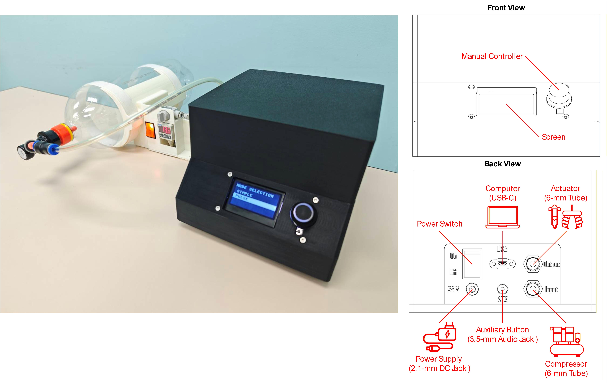
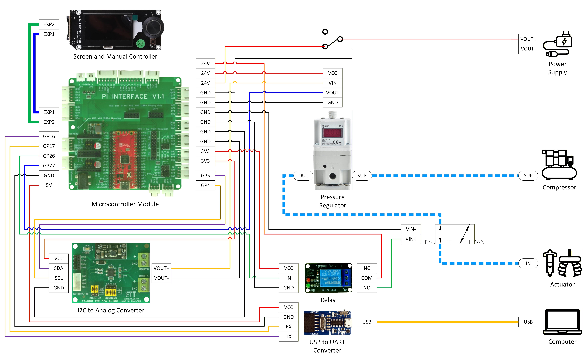

# Open-interface Programmable Pressure Controller

An open-source programmable pressure controller designed for pneumatic actuation in robotics and automation. This device enables computer-controlled air pressure output in real time, through a serial communication protocol. With a built-in manual controller, it also supports stand-alone operation. The controller can be operated from any platform capable of serial communication, making it compatible with a wide range of robotics and automation frameworks. This open-interface design allows the system to be easily adapted and integrated into unique or custom robotic applications.

## Key Specifications

| Parameter            | Specifications                           |
|----------------------|:----------------------------------------:|
| Fluid Type           | Air                                      |
| Set Pressure         | 0–900 kPa                                |
| Power Supply         | 24 VDC, 0.4 A                            |
| Max Frequency        | 10 Hz                                    |
| Programming Protocol | Serial Communication (Baud Rate: 115200) |
| Dimension (WxLxH)    | 185x236.2x150 mm                         |

## Instruction Manual

The instruction manual for the pressure controller is available [here](instruction_manual.pdf).

For device installation, several steps need to be done:
* Connect a 24-VDC power supply to the DC jack connector (5.5 × 2.1 mm). This power line routes through a rocker switch, functioning as the power switch.
* Connect a pressure source, such as a compressor or air tank, via the 6-mm pneumatic input  port.
* Connect a pneumatic actuator via the 6-mm pneumatic output port.
* (Optional) Connect a computer via the USB-C port for programable operation.
* (Optional) Connect an external button via the 3.5-mm jack connector for auxiliary control during manual operation.

## List of Main Components

* [Pi Interface](https://github.com/Ninth2234/Pi_Interface) x1
* ET-MINI I2C D/A x1
* SMC ITV2050-31 x1
* SMC VT307-5G x1
* Cytron UC00C x1
* Single-channel Relay 3.3 V x1
* [Chassis](cad_models/chassis.stl) x1
* [Cover](cad_models/cover.stl) x1
* [Interface Panel](cad_models/interface_panel.stl) x1
* Adafruit 4056 x1
* Rocker Switch x1
* DC Jack Female 5.5x2.1 mm x1
* Audio Jack Female 3.5 mm x1
* SMC KQ2E06 x2

## Programming Commands

Programming commands are flexibly defined and can be modified with the modification in the firmware level. Default commands include:

| Commands    | Descriptions                             |
|:-----------:|------------------------------------------|
| vers        | Report the firmware version              |
| home        | Reset all parameters to default values and return to mode selection. |
| mode        | Read or set the system mode.  • Reading: mode  • Setting to “simple”: mode=simple |
| pres        | Read the feedback value of control pressure in kPa. |
| pref        | Read or set the value of set pressure.  • Reading: pref  • Setting to 100 kPa: pref=100 |
| pmax        | Read or set the max value of set pressure.  • Reading: pmax  • Setting to 500 kPa: pmax=500 |
| offs        | Zero the current feedback value of control pressure.|
| oupt        | Read or set the state of output pressure, in “simple” mode, and output pressure pulses, in “pulse” mode.  • Reading: oupt  • Setting to "on": oupt=on   In “simple” mode, the state “on” controls output pressure to set pressure. The state “off” neutralizes output pressure. On the other hand, in “pulse” mode, the state “on” generates the pulses with output pressure controlled to set pressure. The state “off” stops the pulses and neutralizes output pressure.|
| freq        | Read or set the frequency of output pulses. Available only in “pulse” mode.  • Reading: freq  • Setting to 2 Hz: freq=2 |

## Manual Commands

This device also supports manual operation for stand-alone use. There are three types of button presses for controlling the pressure controller: single press, double press, and press and hold.

| Commands       | Descriptions                             |
|:--------------:|------------------------------------------|
| single press   | In mode selection, enter the highlighted system mode.   In “simple” and “pulse” mode, toggle the output state. |
| double press   | Change the adjusting parameter to the next item on the list. |
| press and hold | Reset all parameters to default values and return to mode selection. |

## Wiring Diagram

## Firmware

The firmware for this device is developed in MicroPython, and its repository can be found [here](https://github.com/Ninth2234/Pi_Interface).

## Video Demonstration

* [Manual Pulse-mode Operation on a Soft Pneumatic Actuator](https://www.youtube.com/watch?v=VrCpQ_EVPBg)
